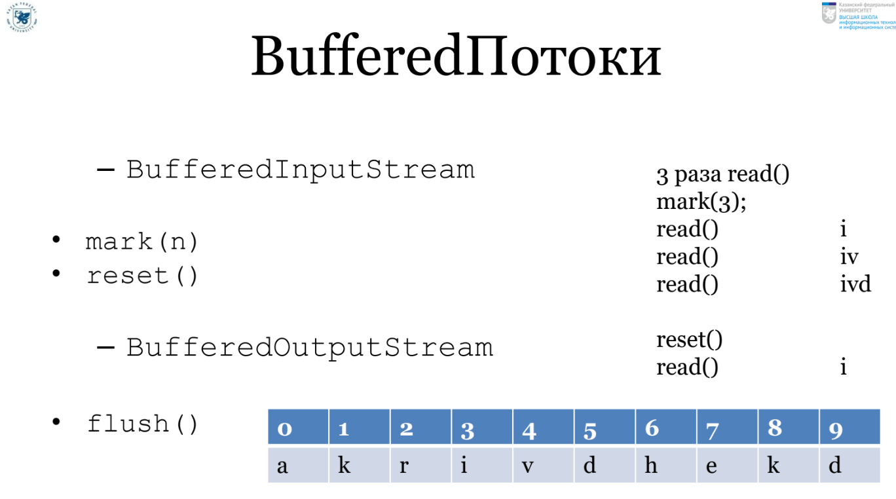
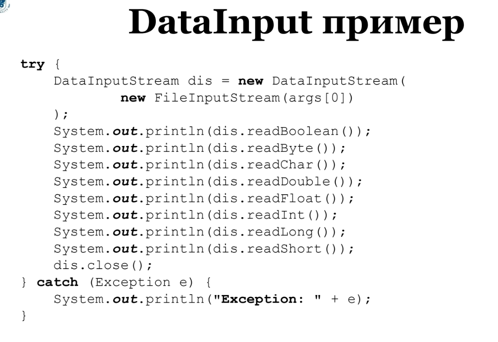
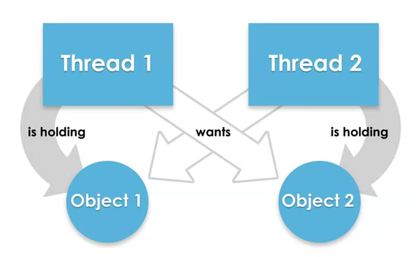

# Лекции по Java 2 семестр
## Пакеты
  
import не рекурсивная операция  
import static импорт статических методов. Например import static java.lang.Math.cos  
Единица компиляции - понятие означающее базовую конструкцию, которая может быть скомпилирована. Включает в себя: Пакет, Импорты, Объявление сущности  
Допустим есть такая иерархия файлов:
`example` -> `src` -> `game` -> `Game.java`, `Player.java`
`Player.java`:
```java
package game;

public class Player {
	public void battleCry() {
		System.out.println("I'm player");
	}
}
```

`Game.java`:
```java
package game;

public class Game {

	public void go() {
		Player p = new Player();
		p.battleCry();
	}

	public static void main(String[] args) {
		(new Game()).go();
	}
}
```
Поскольку эти два файла лежат в одном пакетк импортировать Player в Game не надо.
Попробуем запустить Game.java, находясь при этом по следующему пути: `example/src/game`: `javac Game.java`:
Получим ошибку: `error: cannot find symbol Player p = new Player()`. Game под носом у себя не видит Player.
Чтобы заработало нужно:
 - Создать иерархию папок, соответсвующую иерархии пакетов
 - Поместить исходные файлы в нужные места
 - Поместить все полученное в спец. папку для исходников(src)
 - компилировать из корня проекта(т.е та папка, которая содержит src)

Надо при компилировании Game сказать, где лежит `Player.java`.
Параметр/ключ для команды в команд. строке под названием `sourcepath`.

`javac -sourcepath src src/game/Game.java` <b>

параметр компиляции `-d`:
 - указывает куда поместить соответствующие скомпилированные файлы
 - указывается как значение папка рядом с src(т.к будет аналогичная иерархия) 

При запуске необходимо указывать откуда брать .class-файлы, необходимые для запуска.
Этот параметр называется `classpath`(при компиляции можно писать cp)

 - переменная, содерж путь(или пути через ; ) к необходимым бинарникам:
 - путь к корню иерархии пакетов проекта 
 - пути к библиотекам

 В нашем случае `classpath` - `bin`

 запуск Game: `java -classpath bin game.Game`

## Generics
### Стирание типов
Происходит после компиляции, потому что нужно поддерживать обратную совместимость.
До пятой версии тип коллекций всегда должен был быть Object. 

### Ограничения:
 - new T(), new T[] - нельзя
 - нельзя делать inctanceof для параметра
 - нельзя делать static поле типа T
 - нельзя перегрузить методы двумя классами с разными параметрами
 	void print(List<String> c) и void print(List<Integer> c) - нельзя
 - В коллекциях должны быть объекты - нельзя примитивы

### Неизвестный тип (Wildcard):
Нам нужно объявить метод, принимающий параметризованный класс, но параметр нам неизвестен

```java
public class Printer {
 	public void print(List<...> elements) {
 		//..
 	}
}
``` 

Что же написать вместо <...>:
 - `List<T>` нельзя, т.к неизвестно что такое T
 - `List` - явная заточенность под Object - а если есть специфика?
 - ?

```java
public class Printer {
 	public void print(List<?> elements) {
 		//..
 	}
}
```
### Ковариантность и контрвариантность
### Ковариантность  
Если студент - частный случай человека, то список из студентов - 
частный случай списка из людей.
### Контрвариантность
Животное - родитель  
Рептилия - наследник (расширяет родителя - значит имеет больший
функционал)  
НО: когда мы говорим про зоопарк, очевидно, что больший функуионал имеет зоопарк из животных.  
=> в этом примере имеет место обратная связь:  
если тип1 - наследник тип2, но как будто бы список из тип2 наследник списка из тип1 
- Зоопарк<Животное>
- Зоопарк<Рептилия>
```java
public static void copy(List<? super Number> dest, List<? extends Number> src) {
    for (int i = 0; i < src.size(); i++) {
        dest.set(i, src.get(i));
    }
}
```
- src - должен содержать числа, поэтому extends Number - `ковариантность`
- dest - принимает числа ( но может быть и более общего типа) - поэтому `контрвариантность`
Если захотим написать вместо super - extends `void copy(List<? extends Number> dest, List<? extends Number> src)`,
то столкнемся с ошибкой. Ведь может быть такое что, в лист Integer присваивается значения листа, содержащие Double.
___
Если переводить на язык метафор, то, допустим, у нас есть мешок
яблок. В нем могут лежать Антоновка, зеленые, красные и тд. Если мы
будем перекладывать в дргуой мешок который тоже extends Яблоки
то в нем могут лежать только Антоновки или только красные. Поэтому
нужно второй мешок сделать мешком с большей вместительной характеристикой
например мешок с фруктами. В таком случае гарантированно любой мешок с яблоками мы
переложим в другой мешок.
___

`Ковариантность` (extends)- перенос наследования исходных типов на производные от них типы в прямом порядке. (мы можем добавить какие-то методы, которых нет = наследование).
```java
List<Integer> ints = new ArrayList<>();
List<? extends Number> nums = list;
```
`List<Integer> подтип List<? extends Number>`  
`Контравариантность` (super)- перенос наследования исходных типов на производные от них типы в обратном порядке.
```java
List<Number> nums = new ArrayList<>();
List<? super Integer> ints = new ArrayList<>();
ints = nums; // можно, он не наоборот
```
`List<Number> подтип List<? super Integer>`

## Функциональное программирование
В лямбда-исчислении 2 операции:
- Аппликация - применение ф-ии к аргументу
- Абстракция - построение новых ф-ий
### Аппликация
`ƒa` - ф-ия ƒ применяется к значению а (алгоритм ƒ, вычисляющий
результат по значению а).
### Абстракция
`λx.t[x]` - новая ф-ия с параметром `x` и телом `t[x]`.
___
Выражжение λx.λy.t v w воспринимается как (λx.λy.t v) w
### Каррирование
Суть: т.к ф-ии могут возвращать другие ф-ии как результат,
можно применить многоместную ф-ию к одному аргументу, считая,
что в итоге получается новая ф-ия, применяемая к слд-му аргументу
и так далее.

`(λx.λy.t v) w` => `λy.[x -> v]t`   
Программа - набор шагов, явно описывающих то, что нужно сделать
 и, главное, - как(императивность )  
Лямбда-выражение - программная конструкция для объявления 
функциональных объектов (ф-ий как объектов)  
```text
sumlist(list a b c) = sum a (sumlist (list a b))
sumlist(list a b) = sum a b
```
Пример кода LISP  
```text
(* (+ 2 2) (- 11 1))
(list 1 2 3)
```
## Collections
**Java Collections** - набор интерфейсов и классов-коллекций,
а так же ряда других полезных служебных классов
### Set(extends Collection)
 - Интерфейс
 - Требуется, чтобы те кто реализуют Set, добивались уникальности эл-ов
#### SortedSet
 - comparator()
 - first(), last()
 - subset(a,b), headSet(a) - smaller than a, tailSet(a) - bigger than a
 - NavigableSet(extends SortedSet)
### List(extends Collection)
 - set(i,x),get(i),add(i,x),indexOf(x),lastIndexOf(x),sublist(from,to)...
### Queue (extends Collection)
 Очередь
#### Deque(extends Queue)
 - Очередь с двумя концами
### Map<K,V>
 
### Abstract Collection
 - Чтобы не  все нужно было реализовывать при написании собственных коллекций 
 - Расписаны методы которые используют другие методы, суть которых зависит от конкретной реализации класса

Пример:
```java
abstract class MyCollection<T> implements Collection<T> {
    public abstract boolean add(T x);
    
    public boolean addAll(Collection<? extends T> c) {
        boolean result = false;
        for (T x : c) {
            result = this.add(x) || result;
            // если написать наоборот то поскольку это ленивый оператор после 
            // первого добавленного элемента result станет true и добавления не будет
        }
        return result;
    }
} 
```
### ArrayList (class)
 - Size
 - Capacity
 - loadFactor
### LinkedList (class)
  - Реализует List
  - Реализует Queue, Deque

## Iterator
Цикл for each - синтаксический сахар для использования итератора.
Цикл for each внтури своей реализации использует методы итератора.  
Коллекции имплементят Iterable<T>.
```text
ArrayList<Student> students = new ArrayList<>();
Iterator<Student> i = students.iterator();
while (i.hasNext()) {
    System.out.println(i.next());
}
```
Любой вызов next() - переход к след элементу.  
## Comparable<T>
Интерфейс из java.util, который позволяет сравнивать объекты класса которые реализуют
его с другими объектами.
```java
class A implements Comparable<T> {
    @Override
    public int compareTo(T anotherObject) {
        return 0;
    }
}
```
## Comparator<T>
Сторонний объект умеющий сравнивать два объекта. Аналог: весы.
```java
class StudentComparator implements Comparator<Student> {
    public int compareTo(Student s1, Student s2) {
        return (s1.getAge() - s2.getAge());
    }
}

// Collections.sort(students, new StudentComparator());
```

### Отличия Comparable от Comparator
 - Comparable - используется для сравнения объектов, используя естественный порядок
   + то есть, допустим у нас есть студенты, которым на физре сказали вытроиться по росту
   и так впринципе происходит всегда, они по другим критериям не выстраиваются
   + Comparable как свойство объекта
 - Comparator -  используется для сравнения объектов, используя НЕ естественный порядок
   + есть список студентов, который можно отсортировать по разным критериям и здесь выступает
   Comparator
   + Comparator скорее как сторонний объект

```text
  Employee emp1 = new Employee(1, 100, "Kalim", "Ahmetshin");
  Employee emp2 = new Employee(101, 300, "Ivan", "Petrov");
  Employee emp3 = new Employee(9, 9000, "Ivan", "Aleksandrov");
  List<Employee> list = new ArrayList<>();
  list.add(emp1);
  list.add(emp2);
  list.add(emp3);
  
  // Если вдруг нам нужно сортировать не как обычно по id, а по именам
  // так же можно использовать lambda
  
  Collections.sort(list, (emp1, emp2) -> emp1.name.compareTo(emp2.name));
  // или нужно так
  Collections.sort(list, (emp1, emp2) -> emp1.age.compareTo(emp2.age));
```
Очередь с приоритетами
```text
PriorityQueue<Student> strings = new PriorityQueue<>(new Comparator<String>() {
        @Override
        public int compare(Student s1, student s2) {
            return s1.getAge() - s2.getAge();
        }
    });
```
## Stream API
### Конвейерные операции
 - map, filter
 - distinct
 - sorted
 - mapToInt,mapToDouble...  
### Терминальные
 - findFirst
 - collect
 - forEach
 - reduce  
Терминальные возвращают Optional<T>
## Unit-тестирование(модульное)
 Процесс проверки работоспособности отдельных частей исходного кода
 (чаще всего методов) программы путем запуска тестов в исскуственной
 среде. **Осуществляется разработчиком!**
 ### Test case
Артефакт, описывающий список конкретных шагов, условий и параметров, необходимых
для проверки реализации тестируемой функции или ее части.  
Под кейсом понимается структура вида: Action > Expected Result > Test Result  
Модульное тестирвание нужно для:
 - Ошибки выявляются в процессе проектирование метода или класса(TDD)
 - Разработчик создает методы и классы для конкретных целей
 - Снижается количесво новых ошибок при добавлении новой функц-ти
 - Тест отражает элементы технического задания (некорректное завершение
теста сообщает о нарушении технических требований заказчика)
### Как называть тесты
 - суффикс Test к названии класса(если тесты сгруппированы в классе)
 - суффикс test к ф-ям/методам, если того требует библиотека
 - тестовые методы желательно должны содержать should (sumShouldBePositive)
### Что такое assert
 Проверка ожидание/реальность
 - assertTrue
 - assertFalse
 - assertEquals
 - assertArrayEquals
 - assertNotEquals
 - assertSame
 - assertNotSame
 - fail - гарантированное падение теста
### Покрытие
 - процент кода(строк, методов, классов), покрытого тестами.
 - а так же сами эти тесты
### TDD
 1. Пишем простейший тест, ломающий программу
 2. Пишем простейшую реализацию, достаточную для прохождения теста
 3. Улучшаем написанный код, не ломая тесты. Возвращаемся к пункту 1.
### Expected, Timeout
 ```java
class Test {
    @Test(expected = ArithmeticException.class)
    public void checkZeroDivide() {
        // проверяем исключение делением на ноль
        Math.divide(1, 0);
    }

    // останавливаем когда проходит 100мс
    @Test(timeout = 100)
    public void waitMe() {
        while (true) ;
    }
    
    // если исключений не одно
    @Test
    public void checkZero() {
        // проверяем искл при делении на ноль
        try {
            Math.divide(1,0);
            Assert.fail();
        } catch (ArithmeticException e) {}
        catch (NullPointerException e) {}
        catch (Exception e) {
            throw new AssertionError();
        }
        
    }
}
```
### Классовые аннотации
```text
@DisplayName("A special test case")
@Disabled("Disabled until bug#10 has been fixed")
```
### Ignore, Assume
 - Тест, помеченный @Ignore не выполняется 
 - Вместо Assert можно использовать Assume(assumeEquals, ...)
   + Если проверка верна - тест пройден
   + Если не верна - тест игнорируется
 
### Fixture
Окружение, необходимое для корректной работы теста.(Объекты, БД, файлы)
 * setUpClass / setUpBeforeClass / @beforeClass - запускается только один раз при запуске теста(static).
 * setUp / setUpClass / @Before - запускается перед каждым тестовым методом
 * tearDown / tearDownClass / @After - запускается после каждого метода.
 * tearDownAfterClass / tearDownClass / @AfterClass - запускается после того, как отработали все тестовые методы
### Жизненный цикл тестирующего класса
 * setUp / beforeClass
 * для каждого @Test-метода:
   + создание экземпляра тестового класса
   + выполняется  setUp / Before
   + выполняется test
   + выполняется tearDown / After
 * Выполняется TearDownAfterClass
```java
// JUnit 3
public class TestPlayer extends TestCase {
    Player p1;
    
    public static void setUpBeforeClass() {
        p1 = new Player("Kalim");
    }
    
    public void testHpShouldBe100() {
        Assert.assertEquals(100, p1.getHP());
    }
    
}
```
### Mock
 - Создание: Класс объект = mock(Класс.class)
 - Задание поведения: when(объект.метод(параметры)).thenResult(значение)

```java
import java.io.InputStream;

import static org.mockito.Mocktio.mock;
import static org.mockito.Mocktio.when;

class MockClass {
    public static void main(String[] args) {
        InputStream is = mock(InputStream.class);
        when(is.read()).thenResult(5);
        
        // имитация того как будто мы считываем файл, в котором одни пятерки
        // всегда будет возвращаться 5
        System.out.println(is.read()); // 5
        System.out.println(is.read()); // 5
        // что-то не определено -> возвращать 0 или null
        System.out.println(is.available()); // 0
    }
}
```

```java
import java.io.InputStream;

public class Add {
    public static int add(InputStream is, int n) {
        int s = 0;
        for (int i = 0; i < n; i++) {
            s += is.read();
        }
        return s;
    }
}

class MockTest {
    @Test
    public void testAdd() {
        // Чтобы протестировать функцию сложения всех чисел из файла, нужно было
        // этот файл создать и заполнить. Но это возня.
        InputStream is = mock(InputStream.class);
        when(is.read()).thenReturn(5).thenReturn(6);
        // создаем типо файл в котором при первом счтывании возвр 5 а далее 6
        // соответсвенно если счситать три раза то будет 5-6-6
        Assert.assertEquals(Add.add(is, 3), 17);
    }
}
```

### Проверка вызова

```java
import java.util.Iterator;

class MockTest {
    public static void main(String[] args) {
        Iterator i = mock(Iterator.class);
        when(i.next()).thenReturn("ITIS").thenReturn("KFU");
        i.next();
        // Проверка, что был вызван один раз - тест пройден
        verify(i).next();
        // Проверка, что два раза - тест завалился
        virify(i, times(2)).next();
    }
}
```
Лог ошибки:
```text
Wanted 2 times
But was 1 time
```
## IO
**Файл** - всегда набор битов (байтов, килобайтов, мегабайтов). У бита 2 возможных значенния,
поэтому он называется бинарным.  
**Текстовый файл** - бинарный файл, который при считывании байтов возвращает символы.
Может быть прочитан человеком.
### Почему не все файлы текстовые
Для экономии памяти. 65 и 66 - байты. Получается 2 байта. Но если записать в текстовом
виде `65 66` - уже 5 байтов.  
Еще можно считывать с:
 - консоль
 - сеть
 - устройство
 - структура данных

Современный подход к вводу/выводу: есть **объекты** которые работая с разными источниками
данных(файл, сеть, структура) имеют общий интерфейс(источник данных может поменяться
но это никак не повлияет на код). Эти объекты называются Streams(input/output).
### Streams(input/output)
Как работать:
 - Открыть поток
 - Пока есть информация, читать с него или записать
 - Закрыть поток
 
### java.io
 - InputStream - входной поток
    + read()
 - OutputSteam - выходной поток
    + write()
    
### Тонкости read()
 + Метод read() считывает один байт и превращает его в int
    * Делается это потому что, байты джавовские да и не только первым битом 
   хранят фактор что это отрицательное или положительное число. 
   И поэтому при считывании нам было бы необходимо конвертировать отрицательный байт
   в положительный инт, который потом уже сконвертирвать, например в символ. И чтобы этим не заниматься возвр инт.
 
```java
class IOLek {
    public static void main(String[] args) {
        echo(System.in);
    }

    public static void echo(InputStream in) {
        try {
            int x = in.read();
            while (x != -1) {
                System.out.print((char) x);
                x = in.read();
            }
        } catch (IOException e) {
            System.err.println(e.getMessage());
        }
        System.out.println();
    }
}
```
Чтение нескольких байтов сразу
```text
public int read(byte[] b)
public int read(byte[] b, int offset, int length)
b[offset] - начиная с какого элемента идет запись в массив
length - сколько байтов считать
```
### Откуда можно прочитать данные
Так и называется соответствующий InputStream
 - ByteArrayInputStream
 - FileInputStream
 - StringBufferInputStream
 - PipedInputStream(в связке с OutputInputStream)
    + Что записали в PipedOutput, то будет доступно в PipedInput
    + PipedOutputStream po = new PipedOutputSteam();
    + PipedInputStream pi = new PipedInputStream(po);
 
```java
import java.io.*;
import java.util.*;

class IOLek {
    public static void main(String[] args) {
        fisDemo();
    }
    
    public static void fisDemo() {
        try {
            FileInputStream fis = new FileInputStream("test.txt");
            int i;
            while ( (i = fis.read()) != -1) {
                System.out.println((char)i);
            }
            fis.close();
        } catch (IOException e) {
            System.out.println("Exception");
        }
    }
}
```
### Паттерн Декоратор
Когда нужно дать новое поведение **существующему объекту**.  
А не новое поведение классу/новому объекту. Нужно чтобы новый объект содержал всю
ту информацию, которую накопил старый объект во время работы. А если мы сделаем это
в видео наследования, то создастся чистый новый объект.  
Пример:  
 - A умеет f
 - B умеет f и g

Цель: сдлеать так, чтобы новый объект b делал f в точности так же как и старый объект а.
```java
class A {
    public void f() {
        // ...
    }
}

class B extends A {
    private A a; // содержит экземпляр родителя
    public B(A a) {
        this.a = a;
    }
    
    public void f() {
        a.f();
    }
    
    public void g() {
       // ...
    }
    
}
```
Когда вызываем f() у B - он будет работать в точности так же как и f() у A.
То есть объект B содержит в себе объект A.  
**Декоратор** умеет существующему объекту давать новое поведение, не стирая старое.
Можно выполнить с теми же значениями методы родителя.
### Декораторы IO
 - Дать существующим IO-объектам новые свойства:
   + Буферизация
   + Чтение конкретных типо данных
   + ...
 - В Java - надстройка

Пример:
 Возможность подставлять одни потоки в другие, получая новую функциональность
```text
new DataInputStream(
    new BufferedInputStream(
        new FileInputStream("input.txt")
    )
)
Buffered - поддержка буферизации
DataInput - возможность читать примитивы
```
### Буферизованные потоки
Это история про сокращение количества опреаций прямого считывания и прямой записи,
где источник файлов или приемник файлов находится. Сократить кол-во обращений к
источнику данных (InputStream) или к тому кто данные получает (OutputStream).


### Random Access Files
 - Файл как массив, логика такая же: есть набор данных, есть позиция, можно в любое место ткнуть
с помощью сик() записать и считать с любой позиции.
 - Наслденик как DataInputStream и DataOutputStream
   + "r" for read-only access
   + "rw" for read and write access. Java does not support only write access.For example
 - RandomAccessFile raf = new RandomAccessFile("29.html", "r")
 - методы getFilePointer() - current position,length(), seek()- перемещение на поз.
   + seek на большую позицию чем длина - перемещение в конец
   + запись в конец файла расширяет файл.
 
### READERS/WRITERS
 - read() - char
 - write(x), x - char

 + PrintWriter.println()
 + BufferedReader.readLine()

### Мосты
 - InputStreamReader - преобразует символьный поток в байтовый 
 - OutputSteamWriter - преобразует байтовый поток в символьный 

### Паттерн проектирования "Adapter"
Подменяет все методы старого объекта в виде нового интерфейса для этих методов при
этом вызывая внутри них методы старого объекта
```java
// Adaptee 
class Lamp {
    public void on() { 
       //...
    }
    public void off() { 
       //...
    }
}

// Adapter
class SmartLampForDevice {
    private Lamp lamp;
    public SmartLampForDevice(Lamp lamp) {
        this.lamp = lamp;
    }
    
    public void start() { lamp.on(); }
    public void stop() { lamp.off(); }
}

class SmartDevice {
    SmartLampForDevice slfd;
    public work() {
        slfd.start();
        slfd.stop();
    }
}
```
### Сериализация
Задача превращения объекта в данные и данные в объект.
 - **Сериализация** - запись объекта в поток
 - **Десериализация**  - чтение объекта из потока

## Multitasking
Цель: обеспечить независиммое и одновременное выполнение нескольких программ
(ничего общего с ускорением)
### Виртуальная параллельность
 - Можно читать 3 книги одну за другой
   + это последовательное выполнение
 - Можно читать по несколько страниц одной, затем переходя к другой. В итоге
   через некоторое время все три книги будут прочитаны примерно на одинаковое кол-во
   страниц
   + это вритуальная параллельность ( время работы между переключениями называется тиком)
 
### Thread
Блок кода, который может выполняться параллельно с другими такими же потоками
в рамках одного процесса, программы или приложения. **Процесс** - это штука более менее
изолированная независиммая собственным адресным пространством. **Поток** - часть программы
которая выполняется внутри параллельно с другими такими же потоками, имея общие данные
и прочее.  
В любом приложении есть хотя бы один поток и это main.
### Как работтают потоки
 - N потоков
 - В каждый момент времени работате один поток, остальные стоят
   + "активный поток", "поток перехватил управление"
 - Переключение между потоками (передача управления) происходит _незаметно быстро_ и в общем случае _неупорядоченно_

### Потоки и процессы
 - Поток != Процесс (процесс - уже запущенное приложение)
 - Поток легче - его использование менее затратно
 - 1 процесс может содержать несколько потоков
   + 1 программа внутри себя хочет многозадачности
      * Печать + набор текста
      * Печать + проверка синтаксиса
 
### Жизненный цикл потока
**ПОТОК РАБОТАЕТ ОДИН РАЗ**  
 - Создан, он не запущен
 - Запущен (isAlive = true)
 - Приостановлен
   + например, во время методов sleep, join, wait
 - Закончил работу (isAlive = false)
### Реализация
 Самое главное - реализовать метод run()
 
```java
// Thread - в java.lang
public class MyThread extends Thread {
    public void run() {
        for (int i = 0; i < 100; i++) {
           System.out.println(i);
        }
    }
}
```
### Запуск потока
в дргуом месте, не в классе потока!  
```text
// это создание потока
MyThread t1 = new MyThread();
// это запуск потока
t1.start();
```
### Не путать run() и start()
 - run() - описывает поведение при запуске потока
 - start() - запускает поток с поведением, описанным в run()

sleep() - отправляет текущий поток в ожидание на время => управление передается
другому потоку, и тд.
```java
class MyThread extends Thread {
    public void run() {
        for (int i = 0; i < 10; i++) {
            System.out.println(getName() + ": " + i);
            try {
                Thread.sleep(100);
            } catch (InterruptedException e) {
                e.printStackTrace();
            }
        }
    }
}

class ThreadLek {
    public static void main(String[] args) {
        (new MyThread()).start();
        (new MyThread()).start();
        (new MyThread()).start();

    }
}
```

```java
class MyThread extends Thread {
    private int s = 0;
    public int getS() { return s; }
    public void run() {
        for (int i = 0; i < 50; i++) {
            s += i;
        }
    }
}

class ThreadLek {
    public static void main(String[] args) {
        MyThread t1 = new MyThread();
        t1.start();
        int s = t1.getS();
        System.out.println(s); // => 0
    }
}
```
### join()
Если main вызывает join() у t1, то пока t1 работу не закончит, main работу не
продолжит
```java
class ThreadLek {
    public static void main(String[] args) throws InterruptedException {
        MyThread t1 = new MyThread();
        t1.start();
        t1.join();
        int s = t1.getS();
        System.out.println(s);
    }
}
```

### Runnable

```java
class MyThread implements Runnable {
   public void run() {
        // ...
   }
}

public class Main {
   public static void main(String[] args) {
      Thread t = new Thread(() -> {
          for (int i = 0; i < 10; i++) {
             // ...
          }
      });
      t.start();
   }
}
```
Но зачем полльзователю нашего класса MyThread2 знать тонкости про то,
как запускать поток через Runnable? И теперь все потоки - Thread, даже с разным
поведением?  
Есть решение:  
```java
// Прячем Thread в Runnable
class MyAwesomeThread implements Runnable {
    private Thread thread;
    public MyAwesomeTread() {
       // создаем поток, передавая поведение нашего MyAwesomeThread
        thread = new Thread(this);
        thread.start();
    }
    
    public void run() {
        // ...
    }
}

public class Main {
   public static void main(String[] args) {
      MyAwesomeThread thread = new MyAwesomeThread();
      // поток создается и сразу запускается 
   }
}
```

```java
import java.io.*;
import java.util.*;

class BonusCard {
    private int bonuses;
    public int getBonuses() { return bonuses; }

    public BonusCard(int bonuses) {
        this.bonuses = bonuses;
    }

    public boolean use(int n) {
        if (bonuses >= n) {
            bonuses -= n;
            System.out.println(bonuses + " left");
            return true;
        } else {
            System.out.println("OOOOPS");
            return false;
        }
    }
}

class Human extends Thread {
    private BonusCard bonusCard;
    private String who;

    public Human(BonusCard bonusCard, String who) {
        this.bonusCard = bonusCard;
        this.who = who;
    }

    public void shoppingWithBonuses(int bonuses) {
        if (bonusCard.getBonuses() >= bonuses) {
            System.out.println(who + " is gonna buy something");
            if (bonusCard.use(bonuses))
                System.out.println(who + " bought something");
        } else {
            System.out.println("Sorry, no money");
        }
    }

    @Override
    public void run() {
        for (int i = 0; i < 100; i++) {
            shoppingWithBonuses(7);
        }
    }
}

public class Lek {
    public static void main(String[] args) {
        BonusCard bc = new BonusCard(150);
        Human husband = new Human(bc, "husband");
        Human wife = new Human(bc, "wife");
        husband.start();
        wife.start();
    }
}
```
### Синхронизация
 - Один поток берет объект в единоличное использование (блокирует доступ к объекту)
 - Все остальные потоки ждут, пока он не отпустит блокировку
 - В нашем примере - поток(муж или жена) должен синхронизировать использование бонуса, чтобы дргуой поток не встревал между узнаванием баланса и использованием.

### Монитор
Объект обеспечивающий синхронизацию(пускаю по одному)
### Синхронизация объекта
Первый поток, который придет сюда - встретит synchronized скажет - все я имею доступ
единолично к объекту bonusCard и пошел с ним работать, а другие объекты, которые
пришли в этот же блок будут ждать пока 1 поток не перестанет работать с этим блоком от
открывающейся скобки до закрывающейся. Когда 1 поток закончит опять будет розыгрыш
кто дальше будет работать с объектом
```java
public void shoppingWithBonuses(int bonuses) {
  synchronized (bonusCard) {
      if (bonusCard.getBonuses() >= bonuses) {
          System.out.println(who + " is gonna buy something");
          if (bonusCard.use(bonuses))
              System.out.println(who + " bought something");
      } else {
          System.out.println("Sorry, no money");
      }
  }
}
```
### Синхронизация метода
Если весь функционал, который надо синхронизировать находится в одном методе,
то можно весь метод сдлеть синхронизированным с помощью модификатора synchronized.
### Thread Safety
 - Код потокобезопасен, если он корректно функционирует при одновременном использовании
   его в нескольких потоках



### Модель Produces-Consumer
 - Producer - производит некоторое действие, результатом которого пользуется Consumer
 - Consumer - забирает произведенные рез-т Producer'a когда он готов

```java
class Product {
   private boolean status = false;

   public boolean isReady() {
      return status;
   }

   public boolean isUsed() {
      return !status;
   }

   public void produce() {
      // producing
      this.status = true;
   }

   public void use() {
      // using
      this.status = false;
   }
}

class Producer extends Thread {
   private Product product;

   public Producer(Product p) {
      this.product = p;
   }

   public void run() {
      while (true) {
          while(!product.isUsed());
          product.produce();
      }
   }
}

class Consumer extends Thread {
    private Product product;
    public Consumer(Product p) {
        this.product = p;
    }
    
    public void run() {
        while (true) {
            while(!product.isReady());
            product.use();
        }
    }
}
```
### Object
 - wait()
   + Поток, вызвавший wait(), попадает в список ожидания на этом объекте
 - notify()
   + Поток, вызвавший notify,будит из ожидания один из потоков, попавших в список ожидания
 - notifyAll()
   + Будит всех. Кто-то захватывает управление.
 
```java
class Producer extends Thread { // повар
    // ... 
   private Product product; // тарелка (с супом)
   public void run() {
       while (true) {
           synchronized (product) {
               while (!product.isUsed()) { // пока тарелка не пуста 
                   try {
                       product.wait(); // повар ждет, когда ему вернут тарелку
                   } catch (InterruptedException ignored) {}
               }
               product.produce(); // варит новый суп
               product.notify(); // уведомляем что тарелка готова
           }
       }
   }
}
```

```java
class Consumer extends Thread { // тот кто ест суп
    // ...
    private Product product;
    public void run() {
        while (true) {
            synchronized (product) {
                while (!product.isReady()) { // пока суп не готов
                    try {
                       product.wait(); // ждет пока суп приготовят
                    } catch(InterruptedException ignored) {}
                }
                product.use(); // ест суп
                product.notify(); // говорит что съел
            }
        }
    }
}
```
## Reflection
```java
class Class {
    String name;
    String packageName;
    List<Attribute> attributeList;
    List<Method> methodList;
    // ...
}
```
 - Класс Class - абстракция
 - А все конкретные реализованные классы (String, User, List, Thread ...) - экземпляры класса Class
 - Значит все инструменты ООП мы можем применить к самим классам как к сущностям(посмотреть атрибуты,методы,итд).
   + это и называется рефлексией
   
### Как узнать свой класс?
`Class c = obj.getClass()` - obj - экземпляр класса MyClass.  
`Class c = MyClass.class`  
`Class c = Class.forName(org.kfu.UseClass)` - org.kfu.UseClass - полное имя класса.  
Экземпляры класса, представимого объектом класса Class, можно создавать с помощью
getInstance():  
```java
class MyClass {}

public class Lek {
    public static void main(String[] args) {
        Scanner sc = new Scanner(System.in);
        String type = sc.next();
        Class c = Class.forName(type);
        Object o = c.newInstance(); // тип неизвестен заранее
        System.out.println(o); // MyClass@10f87f48
    }

}
```
Это тоже классы:  
 - Method
 - Filed
 - Constructor
 - Annotation
 - Type
 - Package

### Получить все методы
```java
public class Lek {
    public static void main(String[] args) throws ClassNotFoundException, InstantiationException, IllegalAccessException {
        Class str = String.class;
        Method[] methods = str.getMethods();
        for (Method method : methods) {
            System.out.println(method.getName() + " " + method.getReturnType()); // все методы класса String + возвр знчаения
        }
    }

}
```
Интроспекция - возможность программы исследовать объект во время ее работы.  
### Declared
Рефлексия учитывает инкапсуляцию, хотя может и игнорировать ее
 - getDeclaredMethods(), getDeclaredFields() - возвращает все сущности вне зав-ти от модификатора доступа.
 - аналогичными методами без Declared возвращают только public-сущности.   
 
### Main action 
У класса

 - getMethod(...) - возврат метода по сигнатуре(название+список типов параметров)
   + `String.class.getMethod("charAt", int.class);`
   + `String.class.getMethod("subString", new Class[] {int.class, int.class});`
 - getConstructor(...) - возврат конструктора по сигнатуре по аналогии

У метода

 - invoke() - вызов метода

```java
public class Lek {
    public static void main(String[] args) throws ClassNotFoundException, InstantiationException, IllegalAccessException, NoSuchMethodException, InvocationTargetException {
        Scanner sc = new Scanner(System.in);
        Class cv1 = Class.forName(sc.next()); // у какого класса
        Class cv2 = Class.forName(sc.next()); // аргумент
        String methodName = sc.next();
        Method method = cv1.getMethod(methodName, cv2);
        Object o1 = cv1.newInstance();
        Object o2 = cv2.newInstance();
        // вызываю у o1 метод method (с именем methodName) на объекте o2
        method.invoke(o1, o2);
    }

}
```
Работает если:

 - java.util.HashSet java.lang.Integer add
   + т.к в HashSet есть add(Object)
 - java.lang.Thread java.lang.Stream setName
   + т.к в java.lang.Thread есть setName(String)

```java
abstract class EvilGuy {
    public abstract void attack();
}

class EvilKnight extends EvilGuy {
    public void attack() {
       System.out.println("-10 hp");
    }
}

class EvilShooter extends EvilGuy {
    public void attack() {
       System.out.println("-20");
    }
}

public class Lek9 {
   public static void main(String[] args) {
      // сюда может попасть любой EvilGuy, но мы знаем что точно evilguy
      // работой этого кода  можно управлять извне, без необходимости перекомпилировать его
      String name = args[0]; 
      Class<EvilGuy> c = Class.forName(name);
      EvilGuy eg = c.newInstance();
      eg.attack();
   }
}
```
### IMPORTANT
Я могу управлять работой программ гибко, на разных классах, не переписывая их и не компилируя 
каждый раз заново! Это легло в основу многих java-фреймворков.

## Аннотации
### Метаданные
 - Не влияют на непосредственную работу программы
 - Но могут быть выявлены другими программами на этапе компилирования или разработки, которые при этом
скорректируют свою работу.

```java
class A {
    public void f() {}
}

class B extends A {
    @Override
    public void f() {} // переопределяем
}

class C extends A {
    @Override // тут оверрайд скажет нам что мы не переопределяем метод и не даст скомпилировать
    public void f(int x) {} // перегружаем
}
```
Просходит путем сравнения сигнатур у текущего класса и родитля с помощью рефлексии.  
Override - аннотация (метаданные).
Про **Аннотации**

 - Не влияют на работу кода но могут быть обнаружены другими средствами
 - Могут быть аннотированы класс, метод, параметр, атрибут и т.д

### Создание аннотаций
Реализация  
`@interface MyAnno {}`  
Использование  
```text
@MyAnno
class MyClass {
    ...
}
```
### Методы-члены аннотации
 - Объявляются как методы

```text
@interface Author {
    String name();
    int year() default 2000; // дефолтное значение
}
```

 - Но используются как поля

```text
@Author(name="Kalim", year=2003)
class MyClass {
    ...
}
```

### Аннотации, аннотирующие аннотации
@Retention - политика удержания аноотации(до какого этапа компилироания или выполнения аннотация видна).  
Значения лежат в перечислении RetentionPolicy:  
 - SOURCE - отбрасывается при компиляции
 - CLASS - сохр в байт-коде, но недоступны во время работы
 - RUNTIME - сохр в байт-коде и доступны во время работы

@Target - к чему может быть применена аннотация? Значения - из перечисления ElementType
 - FIELD
 - METHOD
 - TYPE - класс интерфейс перечисление
 - ...

Может применяться к нескольким: @Target({ElementType.TYPE, ElementType.METHOD })
```text
@Retention(RetentionPolicy.RUNTIME)
@Target(ElementType.TYPE)
@interface Author {
    String name();
    int year() default 2000;
}
```

### Проверка аннотаций через рефлексию
```text
// Проверяем что вектор аннотирован @Author
Class cv = Vector2D.class;
Annotation[] annotations = cv.getAnnotations();
for (Annotation annotation : annotations) {
    if (annotation instanceof Author) {
        ...
    }
}
```

### Реализация @Override
```java
@Retention(RetentionPolicy.RUNTIME)
@Target(ElementType.METHOD)
@interface MyOverride {}

@interface SomeAnnotation {}

class A {
    public void f(int a, int b) {}
}

class B extends A {
    @MyOverride
    public void f(int a) {}

    @SomeAnnotation
    public void g() {}

}

public class Lek {
   public static void main(String[] args) throws ClassNotFoundException, InstantiationException, IllegalAccessException, NoSuchMethodException, InvocationTargetException {
      Class cv = B.class;
      Method[] methods = cv.getMethods();
      for (Method method : methods) {
         for (Annotation annotation : method.getAnnotations()) {
            if (annotation instanceof MyOverride) {
               String methodName = method.getName();
               Class[] parameters = method.getParameterTypes();
               Class superClass = cv.getSuperclass();
               try {
                  superClass.getMethod(methodName, parameters);
               } catch (NoSuchMethodException exception) {
                  System.out.println("Сигнатура не сходится");
               }
            }
         }
      }
   }
}

```

### Вызвать у заданного класса заданный метод без параметров через рефлексию
```text
   Class cv = C.class;
   Object o1 = cv.newInstance();
   cv.getMethod(methodName).invoke(o1); // вызов у o1 метод methodName()
```
### Deadlock example
```java
public class Lek {

    static class Friend {
        private final String name;
        public Friend(String name) {
            this.name = name;
        }
        public String getName() { return this.name; }

        public synchronized void bow(Friend bower, int threadNumber) {
            System.out.println("Поток номер " + threadNumber + " удерживает объект " + this.getName());
            bower.bowBack(this, threadNumber);
        }

        public synchronized void bowBack(Friend bower, int threadNumber) {
            System.out.println(
                    "Поток номер " + threadNumber + " освобождает объект " + this.getName() +
                            "и хочет удерживает объект " + bower.getName()
            );
        }
    }

    public static void main(String[] args) {
        Friend alphonse = new Friend("alphonse");
        Friend gaston = new Friend("gaston");

        new Thread(new Runnable() {
            @Override
            public void run() {
                alphonse.bow(gaston, 1);
            }
        }).start();

        new Thread(new Runnable() {
            @Override
            public void run() {
                gaston.bow(alphonse, 2);
            }
        }).start();
    }
}
```

### Runtime Annotations(Аннотации, которые влияют на Java-код)
```java
@Target(ElementType.TYPE)
@Retention(RetentionPolicy.RUNTIME)
@interface RuntimeAnnotation {
    String name() default "ABC";
    String city() default "CDE";
}

@RuntimeAnnotation
class RuntimeAnnotationTestClass {}

public class Lek {
    public static void main(String[] args) {
        Annotation annotation = RuntimeAnnotationTestClass.class.getAnnotation(RuntimeAnnotation.class);
        RuntimeAnnotation annotation1 = (RuntimeAnnotation) annotation;

        System.out.println(annotation1.city() + " " + annotation1.name());
    }
}
```

### Реализация класса "Итератор" для одномерного массива целых чисел
```java
class ArrayIterator {
    private int[] arr;
    private int capacity;
    private int currentElement;

    public ArrayIterator(int[] arr) {
        this.arr = arr;
        this.capacity = arr.length;
        this.currentElement = 0;
    }

    public int next() { return arr[currentElement++]; }
    public boolean hasNext() { return currentElement < capacity; }
}

public class Lek {
    public static void main(String[] args) {
        ArrayIterator iterator = new ArrayIterator(new int[] {1,2,3,4,5});
        while (iterator.hasNext()) {
            System.out.println(iterator.next());
        }
     }
}
```

### Пример потокобезопасного кода
Причем, если убрать **synchronized**, то list.size() будет всегда < 200 000
```java
class Thread1 extends Thread {
    LinkedList<Integer> list;
    public Thread1(LinkedList<Integer> list) {
        this.list = list;
    }

    public void run() {
        synchronized (list) {
            for (int i = 0; i < 100000; i++) {
                list.add(i);
            }
        }
    }
}

public class Lek {
    public static void main(String[] args) throws InterruptedException {
        LinkedList<Integer> list = new LinkedList<>();
        Thread1 thread1 = new Thread1(list);
        Thread1 thread2 = new Thread1(list);
        thread1.start();
        thread2.start();
        Thread.sleep(2000);
        System.out.println(list.size());
    }
}
```

### Зачем нужны контрвариантность и ковариантность
С помощью них можно обозначить что этот лист только для записи или
только для чтения
```java
class Fruit {}
class Citrus extends Fruit {
    int weight;
}
class Orange extends Citrus { }

public class Lek {

   public static int totalWeight(ArrayList<? extends Citrus> oranges) {
      int weight = 0;
      for (int i = 0; i < oranges.size(); i++) {
         weight += oranges.get(i).weight;
      }

//       oranges.add(new Citrus()) ошибка записывать нельзя, потому что вместо ? может быть допустим
//       Orange, и мы записываем в list потомков предка чего делать нельзя
//       следовательно из этого листа можео только читать
      return weight;
   }

   public static void addOranges(ArrayList<? super Orange> oranges) {
      for (int i = 0; i < 10; i++) {
         oranges.add(new Orange());
      }
//        Citrus c = oranges.get(0) - нельяз, потому что вместо ? мог бы быть Fruit
//        и мы бы записали в потомка родителя чего делать нельзя
//        следовательно этот лист только для записи
   }
}
```